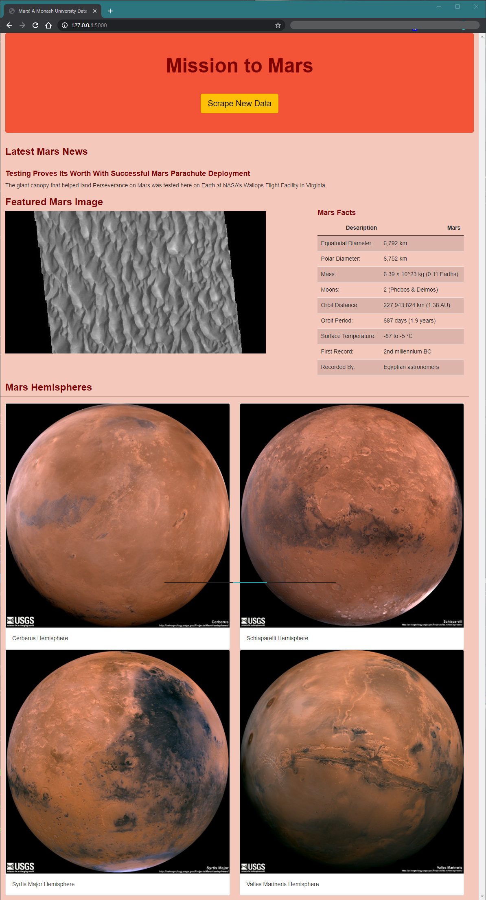

# Web Scraping Homework - Mission to Mars

### Files and Directories:

1. Screenshot showing successful completion of the homework task is located in the [root directory](https://github.com/welanc/web-scraping-challenge/).

2. `mission_to_mars.ipynb` Jupyter Notebook, `app.py` Flask Application and `scrape_mars.py` web scraper (export of Jupyter Notebook code) are all located in the directory [Mission_to_Mars](https://github.com/welanc/web-scraping-challenge/tree/master/Missions_to_Mars). The `table.html` scraped from Jupyter Notebook is also located in this directory.

3. **Note**: `mission_to_mars.ipynb` was exported from Jupyter Notebook to a file named `mission_to_mars.py`. Relevant portions of the code were copied and pasted into `scrape_mars.py` as the direct export from Jupyter Notebook had superfluous lines of code related to running the code in Jupyter Notebook. The original export is in the directory [Mission_to_Mars/superseded](https://github.com/welanc/web-scraping-challenge/tree/master/Missions_to_Mars/superseded).

4. The template file `index.html` used to show the Flask Application output is in the directory [Mission_to_Mars/templates](https://github.com/welanc/web-scraping-challenge/tree/master/Missions_to_Mars/templates).